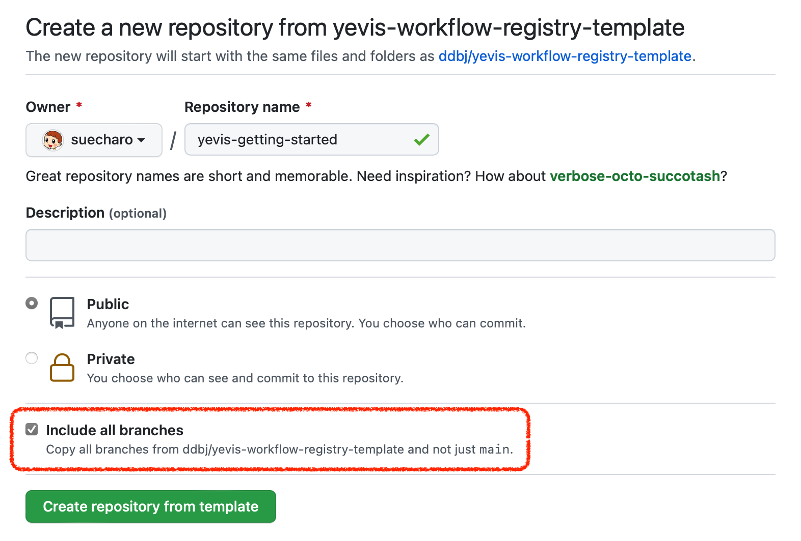
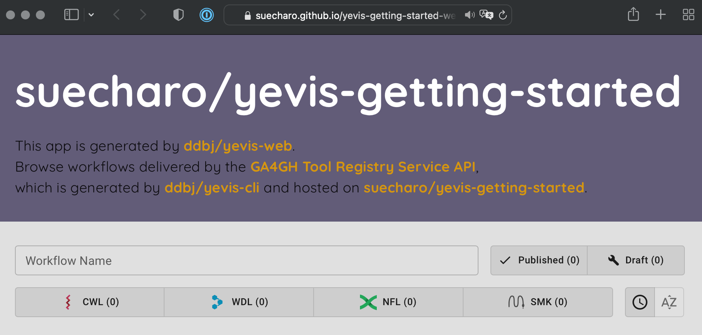
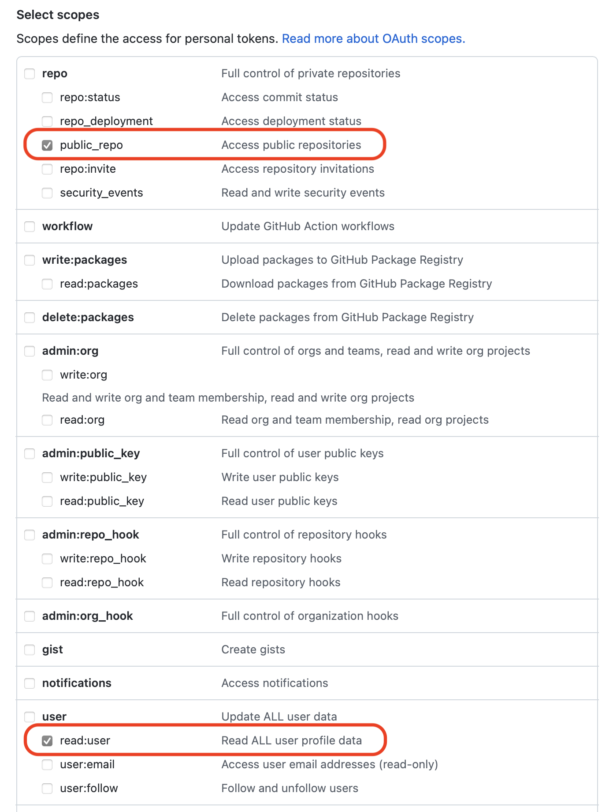
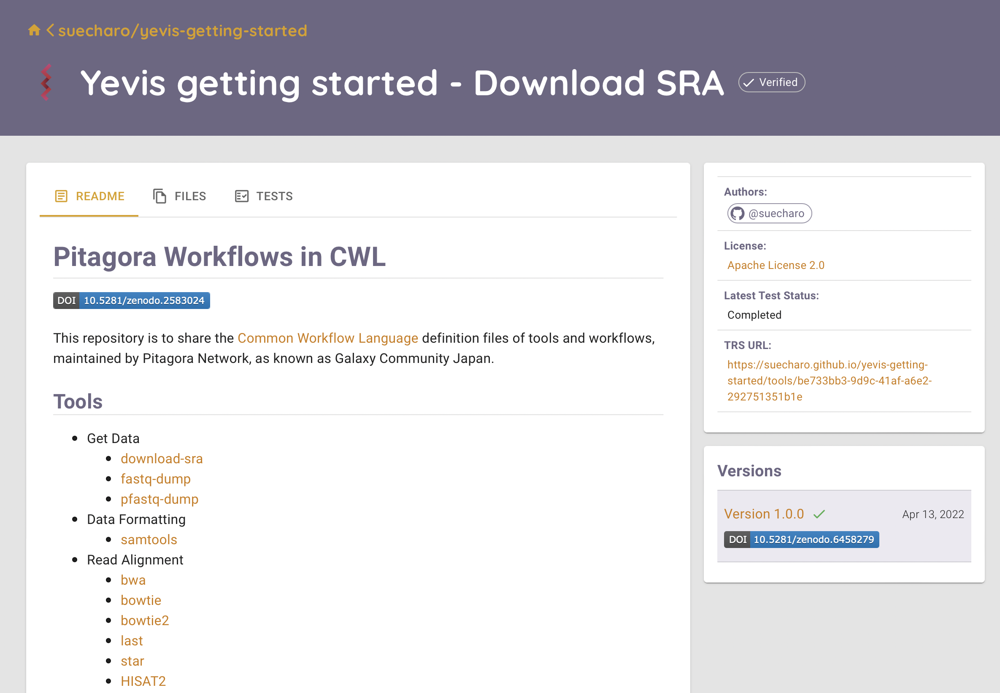
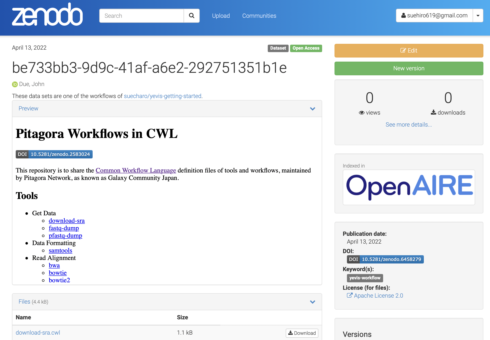

# Yevis Getting Started

This document describes how to build and maintain the Yevis workflow registry.

## 1. Preparation of the Workflow Registry

### 1.1. Creation of the GitHub Repository

Prepare a GitHub Repository for distributing workflow metadata and [GA4GH Tool Registry Service (TRS) API](https://www.ga4gh.org/news/tool-registry-service-api-enabling-an-interoperable-library-of-genomics-analysis-tools/).

Use [GitHub - sapporo-wes/yevis-workflow-registry-template](https://github.com/sapporo-wes/yevis-workflow-registry-template) as a template.

Click on this [Link](https://github.com/sapporo-wes/yevis-workflow-registry-template/generate) to start the creation of the GitHub repository.

**Don't forget to check the `Include all branched` option.**



You can set `README.md` and `LICENSE` files freely.

### 1.2. Setting Up the GitHub Repository

Set up the GitHub Pages site in `[Settings] - [Pages]` of the created repository.


Also, in `[Settings] - [Actions] - [General]`, make sure that the workflow permissions have `Read` and `Write` access.


### 1.3. Generation and Placement of a Zenodo Token

Generate a Zenodo Token from this [Link](https://zenodo.org/account/settings/applications/tokens/new/).

The required scopes are as follows:

- `deposit:actions`
- `deposit:write`


Then, in `[Settings] - [Secrets] - [Actions]` of the created repository, register the generated token as GitHub Secrets named `ZENODO_TOKEN`.


## 2. Preparation of `yevis-web`

Deploy [`sapporo-wes/yevis-web`](https://github.com/sapporo-wes/yevis-web), a web application to browse a workflow registry.

First, click on this [Link](https://github.com/sapporo-wes/yevis-web/generate) to start the creation of the GitHub repository.

**Do not need to check the `Include all branched` option.**


You can set `README.md` and `LICENSE` files freely.

---

In `[Settings] - [Actions] - [General]`, make sure that the workflow permissions have `Read` and `Write` access.


---

Then, execute the GitHub Actions workflow in `[Actions] - [deploy-dispatch]` of the created repository.

Enter the following parameters for running the workflow:

- `Yevis workflow registry`: the GitHub repository name of the workflow registry created in `Section 1.1.` (e.g., `suecharo/yevis-getting-started`).
- `GitHub Pages branch`: the branch name of the GitHub Pages site.
- `TRS API endpoint`: the URL of the TRS API (e.g., `https://${repo_owner}.github.io/${repo_name}/`).


After completing the `deploy-dispatch` workflow, go to `[Settings] - [Pages]` and set up the GitHub Pages site.


After completing the deploy action for GitHub Pages, `yevis-web` is deployed to the GitHub Pages site.



## 3. Workflow Registration

Workflow registration is divided into three processes:


### 3.1. Workflow Submission Process

Install [`yevis-cli`](https://github.com/sapporo-wes/yevis-cli), see [`yevis-cli` - Installation](https://github.com/sapporo-wes/yevis-cli#installation).

In this document, uses a Docker environment since using M1 Mac (the binary is only built for Linux).

```bash=
$ curl -fsSL -O https://raw.githubusercontent.com/sapporo-wes/yevis-cli/main/docker-compose.yml
$ docker compose up -d
[+] Running 2/2
 ⠿ Network yevis-network  Created                                                                   0.0s
 ⠿ Container yevis-cli     Started                                                                   0.2s
$ docker ps
CONTAINER ID   IMAGE                          COMMAND            CREATED          STATUS          PORTS     NAMES
929d689b61f2   ghcr.io/sapporo-wes/yevis-cli:0.4.0   "sleep infinity"   34 seconds ago   Up 33 seconds             yevis-cli
$ docker compose exec app bash

root@929d689b61f2:/app# yevis --help
yevis 0.4.0
DDBJ(Bioinformatics and DDBJ Center)
...
```

Next, obtain a `GitHub Personal Access Token` for use within `yevis-cli`.

For instructions on creating a `GitHub Personal Access Token`, see [GitHub Docs - Creating a personal access token](https://docs.github.com/en/authentication/keeping-your-account-and-data-secure/creating-a-personal-access-token).

The required scopes are as follows:

- `repo - public_repo`
- `user - read:user`



The generated `GitHub Personal Access Token` can be passed to `yevis-cli` in one of the following ways:

- `.env` file: write the `.env` file as `GITHUB_TOKEN=<PASTE_YOUR_TOKEN>`.
- Environment variables: Set the `GITHUB_TOKEN` environment variable.
- Command-line option: Use `--gh-token <PASTE_YOUR_TOKEN>`.

This time, use environment variables:

```bash=
$ export GITHUB_TOKEN=<PASTE_YOUR_TOKEN>
```

#### 3.1.1. Describe metadata

Create a file, `yevis-metadata.yml`, a workflow metadata collection.

As an example of a workflow, use [`https://github.com/pitagora-network/pitagora-cwl/blob/master/workflows/download-fastq/download-fastq.cwl`](https://github.com/pitagora-network/pitagora-cwl/blob/master/workflows/download-fastq/download-fastq.cwl).

Note that:

- **Relative paths from a workflow should be avoided**.
  - At WES runtime, the `target` field can be used to place files in relative paths, such as `tools/tool.cwl`.
  - However, Zenodo hosts the file as a flattened URL, such as `https://<zenodo_base>/tools_tool.cwl`.
  - Therefore, if `wf.cwl` contains a line like `run: tools/tool.cwl`, an error will occur when running the workflow.
    - **Please run `cwltool --pack` to pack them into a single workflow file.**

Make a template file for `yevis-metadata.yml` with `yevis make-template` as follows:

```bash=
$ yevis make-template https://github.com/pitagora-network/pitagora-cwl/blob/master/tools/download-sra/download-sra.cwl
Start yevis
Running make-template
Making a template from https://github.com/pitagora-network/pitagora-cwl/blob/master/tools/download-sra/download-sra.cwl
Success make-template

$ ls yevis-metadata.yml
yevis-metadata.yml
```

Edit the generated `yevis-metadata.yml` as follows:

```yaml=
id: be733bb3-9d9c-41af-a6e2-292751351b1e
version: 1.0.0
license: Apache-2.0
authors:
  - github_account: suecharo
    name: Due, John
    affiliation: "The University of Tokyo"
    orcid: "0000-0003-2765-0049"
workflow:
  name: Yevis getting started - Download SRA
  readme: "https://github.com/pitagora-network/pitagora-cwl/blob/master/README.md"
  language:
    type: CWL
    version: v1.0
  files:
    - url: "https://github.com/pitagora-network/pitagora-cwl/blob/master/tools/download-sra/download-sra.cwl"
      target: download-sra.cwl
      type: primary
  testing:
    - id: test_1
      files:
        - url: "https://github.com/pitagora-network/pitagora-cwl/blob/master/tools/download-sra/download-sra.yml"
          target: wf_params.yml
          type: wf_params
```

#### 3.1.2. Validate metadata

Validate `yevis-metadata.yml` with `yevis validate` as follows:

```bash=
$ yevis validate ./yevis-metadata.yml
Start yevis
Running validate
Validating ./yevis-metadata.yml
Success validate
```

#### 3.1.3. Run tests

Run tests with `yevis test`.

If `--wes-location` is not specified, `yevis-cli` will launch Sapporo using Docker and run the tests.
Therefore, the `docker` command and Docker Socket must be available.

```bash=
$ yevis test ./yevis-metadata.yml
Start yevis
Running validate
Validating ./yevis-metadata.yml
Success validate
Running test
Starting sapporo-service using docker_host: unix:///var/run/docker.sock
Stdout from docker:
51841ce5da7ff0e166cd9ad2dfb564d6a0ef626fbac72fb43a96c118df43811d
Use WES location: http://yevis-sapporo-service:1122/ for testing
Test workflow_id: be733bb3-9d9c-41af-a6e2-292751351b1e, version: 1.0.0
Testing test case: test_1
WES run_id: a45f20ba-6b76-40b2-ac12-f669a2b82ce2
Complete test case: test_1
Passed all test cases in workflow_id: be733bb3-9d9c-41af-a6e2-292751351b1e, version: 1.0.0
Stopping sapporo-service
Stdout from docker:
yevis-sapporo-service
Success test
```

On the Host OS, the following container is launched:

```bash=
$ docker ps
CONTAINER ID   IMAGE                                         COMMAND                  CREATED          STATUS          PORTS      NAMES
ff447ea21f90   ghcr.io/inutano/download-sra:177141a          "download-sra -r ddb…"   3 seconds ago    Up 3 seconds               focused_rhodes
bc58bac48e3c   quay.io/commonwl/cwltool:3.1.20211107152837   "/cwltool-in-docker.…"   49 seconds ago   Up 48 seconds              sweet_saha
51841ce5da7f   ghcr.io/sapporo-wes/sapporo-service:1.1.2     "tini -- sapporo --r…"   56 seconds ago   Up 56 seconds   1122/tcp   yevis-sapporo-service
33d426de77c7   yevis-cli:0.4.0                               "sleep infinity"         3 hours ago      Up 2 minutes               yevis-cli
```

#### 3.1.4. Create Pull Request

Create a Pull Request for the Repository created in `Section 1.1.`.

Unless passing validation and testing, cannot create a Pull Request.

```bash=
$ yevis pull-request -r suecharo/yevis-getting-started ./yevis-metadata.yml
Start yevis
Running validate
Validating ./yevis-metadata.yml
Success validate
Running test
Starting sapporo-service using docker_host: unix:///var/run/docker.sock
Stdout from docker:
8c693de066c12f64e5f322a9e0ecc555b509d1e4db8e072335cfa16083836516
Use WES location: http://yevis-sapporo-service:1122/ for testing
Test workflow_id: be733bb3-9d9c-41af-a6e2-292751351b1e, version: 1.0.0
Testing test case: test_1
WES run_id: 057e23f9-8527-49e2-9e50-f18989ab6a82
Complete test case: test_1
Passed all test cases in workflow_id: be733bb3-9d9c-41af-a6e2-292751351b1e, version: 1.0.0
Stopping sapporo-service
Stdout from docker:
yevis-sapporo-service
Success test
Running pull-request
Creating a pull request based on workflow_id: be733bb3-9d9c-41af-a6e2-292751351b1e, version: 1.0.0
Creating branch be733bb3-9d9c-41af-a6e2-292751351b1e
Branch be733bb3-9d9c-41af-a6e2-292751351b1e has been created
Creating pull request to suecharo/yevis-getting-started
Pull Request URL: https://github.com/suecharo/yevis-getting-started/pull/1
Success pull-request
```

### 3.2. Workflow Review Process

A workflow submitted as a pull request is automatically validated and tested by [GitHub Action - `yevis-publish-pr.yml`](https://github.com/sapporo-wes/yevis-cli/blob/main/actions_exmaple/yevis-publish-pr.yml).


Then, merge a pull request.

### 3.3. Workflow Publication Process

After merging the pull request, it will be published automatically by [GitHub Action - `yevis-publish-pr.yml`](https://github.com/sapporo-wes/yevis-cli/blob/main/actions_exmaple/yevis-publish-pr.yml).

Publication workflow is running:

! [publish-action.png](. /img/publish-action.png)

Publication workflow is finished:

! [publish-action-finished.png](. /img/publish-action-finished.png)

Next, look at `yevis-web` deployed in `Section 2.`, to browse the published workflow.

`yevis-web`:




Zenodo:


