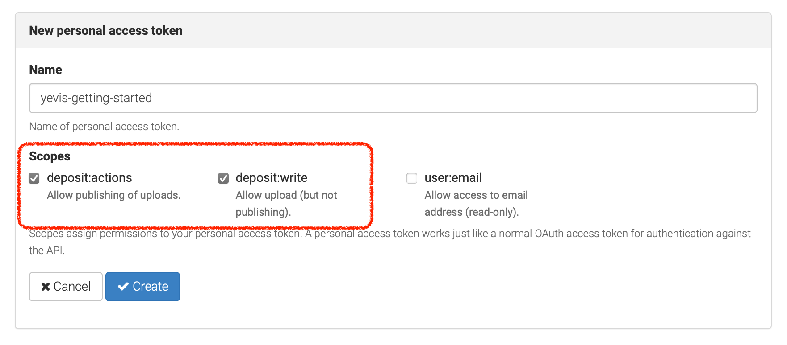
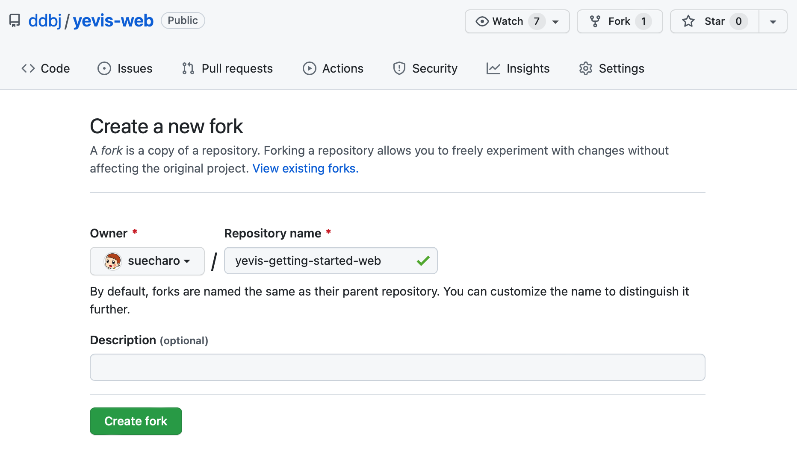
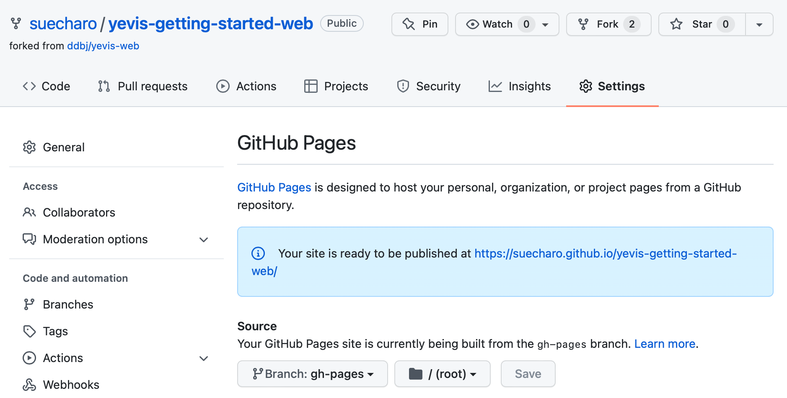
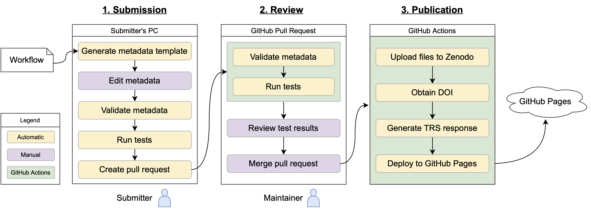
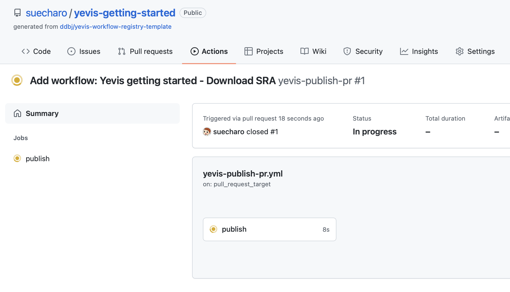
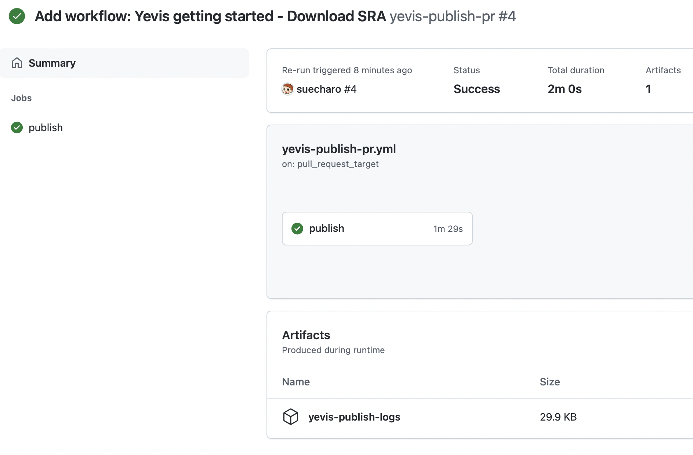

# Yevis Getting Started Ja

このドキュメントでは、Yevis workflow registry の構築と維持について説明します。

## 1. Workflow Registry の準備

### 1.1. GitHub Repository の作成

ワークフローのメタデータと [GA4GH Tool Registry Service (TRS) API](https://www.ga4gh.org/news/tool-registry-service-api-enabling-an-interoperable-library-of-genomics-analysis-tools/) を配布するための GitHub Repository を準備します。

テンプレートとして、[GitHub - ddbj/yevis-workflow-registry-template](https://github.com/ddbj/yevis-workflow-registry-template) を使用します。

この [Link](https://github.com/ddbj/yevis-workflow-registry-template/generate) をクリックすると、GitHub Repository の作成が開始されます。

**`Include all branched` オプションにチェック入れることを忘れずに。**


`README.md` と `LICENSE` はファイルは自由に設定できます。

### 1.2. GitHub Repository の設定

作成したリポジトリの `[Settings] - [Pages]` において、GitHub Pages を設定します。


また、`[Settings] - [Actions] - [General]` において、ワークフローのパーミッションが `Read` と `Write` のアクセス権を持っていることを確認します。


### 1.3. Zenodo Token の生成と配置

この [Link](https://zenodo.org/account/settings/applications/tokens/new/) から Zenodo Token を生成します。

必要なスコープは以下の通りです。

- `deposit:actions`
- `deposit:write`



次に、作成したリポジトリの `[Settings] - [Secrets] - [Actions]` において、生成されたトークンを GitHub Secrets として `ZENODO_TOKEN` という名前で登録します。


## 2. `yevis-web` の用意

ワークフローをブラウズするための Web Application、[`ddbj/yevis-web`](https://github.com/ddbj/yevis-web) をデプロイします。

まず、[`ddbj/yevis-web`](https://github.com/ddbj/yevis-web) を Fork します。



次に、フォークしたリポジトリの `[Actions] - [deploy-dispatch]` にある GitHub Actions ワークフローを実行します。

ワークフローを実行するために、以下のパラメータを入力します。

- `Yevis workflow registry`: `Section 1.1.` で作成した workflow registry の GitHub リポジトリ名 (e.g., `suecharo/yevis-getting-started`)
- `GitHub Pages branch`: GitHub Pages の branch 名
- `TRS API endpoint`: TRS API の URL (e.g., `https://suecharo.github.io/yevis-getting-started/`)


`deploy-dispatch` ワークフローが完了したら、`[Settings] - [Pages]` に移動して GitHub Pages を設定します。



GitHub Pages の deploy アクションが完了すると、`yevis-web` が GitHub Pages にデプロイされます。


## 3. Workflow の登録

ワークフローの登録は、3 つのプロセスに分かれています。



### 3.1. Workflow Submission Process

[`yevis-cli`](https://github.com/ddbj/yevis-cli) をインストールします。

[`yevis-cli` - Installation](https://github.com/ddbj/yevis-cli#installation) を参照してください。

このドキュメントでは、M1 Mac を使用しているため、Docker 環境を使用します （binary は Linux 用にのみビルドされています）。

```bash=
$ curl -fsSL -O https://raw.githubusercontent.com/ddbj/yevis-cli/main/docker-compose.yml
$ docker compose up -d
[+] Running 2/2
 ⠿ Network gh-trs-network  Created                                                                   0.0s
 ⠿ Container yevis-cli     Started                                                                   0.2s
$ docker ps
CONTAINER ID   IMAGE                          COMMAND            CREATED          STATUS          PORTS     NAMES
929d689b61f2   ghcr.io/ddbj/yevis-cli:0.1.7   "sleep infinity"   34 seconds ago   Up 33 seconds             yevis-cli
$ docker compose exec app bash

root@929d689b61f2:/app# yevis --help
yevis 0.1.8
DDBJ(DNA Data Bank of Japan)
...
```

次に `yevis-cli` 内で使用する `GitHub Personal Access Token` を取得します。

`GitHub Personal Access Token` の生成方法については、 [GitHub Docs - Creating a personal access token](https://docs.github.com/en/authentication/keeping-your-account-and-data-secure/creating-a-personal-access-token) を参照してください。

必要なスコープは以下の通りです。

- `repo - public_repo`
- `user - read:user`


生成された、`GitHub Personal Access Token` は、以下のいずれかの方法で `yevis-cli` に渡します。

- `.env` file: `.env` ファイルに `GITHUB_TOKEN=<PASTE_YOUR_TOKEN>` と記述する
- 環境変数: 環境変数に `GITHUB_TOKEN` を設定する
- Command-line option: `--gh-token <PASTE_YOUR_TOKEN>` を使用する

今回は、環境変数を使用します。

```bash=
$ export GITHUB_TOKEN=<PASTE_YOUR_TOKEN>
```

#### 3.1.1. Describe metadata

ワークフローのメタデータをまとめたファイル `yevis-metadata.yml` を作成します。

ワークフローの例として、[`https://github.com/pitagora-network/pitagora-cwl/blob/master/workflows/download-fastq/download-fastq.cwl`](https://github.com/pitagora-network/pitagora-cwl/blob/master/workflows/download-fastq/download-fastq.cwl) を使用します。

注意すべき点として:

- **ワークフローは GitHub 上でホストされている必要があります**
- **ワークフローからの相対パスはなるべく避ける必要があります**
  - WES 実行時、`target` field を使って、`tools/tool.cwl` のように相対パスでファイルを配置することができます。
  - しかし、Zenodo では、`https://<zenodo_base>/tools_tool.cwl` のような flatten された URL としてファイルが hosting されます
  - そのため、ワークフローの実行時に `run: tools/tool.cwl` のような行が `wf.cwl` が含まれるとエラーになります
    - **`cwltool --pack` を実行して、一つのファイルにまとめてください**

以下のように、`yevis make-template` を使用して `yevis-metadata.yml` のテンプレートファイルを作成します。

```bash=
$ yevis make-template https://github.com/pitagora-network/pitagora-cwl/blob/master/tools/download-sra/download-sra.cwl
Start yevis
Running make-template
Making a template from https://github.com/pitagora-network/pitagora-cwl/blob/master/tools/download-sra/download-sra.cwl
Success make-template

$ ls yevis-metadata.yml
yevis-metadata.yml
```

生成された `yevis-metadata.yml` を以下のように編集します。

```yaml=
id: be733bb3-9d9c-41af-a6e2-292751351b1e
version: 1.0.0
license: Apache-2.0
authors:
  - github_account: suecharo
    name: Due, John
    affiliation: "The University of Tokyo"
    orcid: "0000-0003-2765-0049"
workflow:
  name: Yevis getting started - Download SRA
  readme: "https://github.com/pitagora-network/pitagora-cwl/blob/master/README.md"
  language:
    type: CWL
    version: v1.0
  files:
    - url: "https://github.com/pitagora-network/pitagora-cwl/blob/master/tools/download-sra/download-sra.cwl"
      target: download-sra.cwl
      type: primary
  testing:
    - id: test_1
      files:
        - url: "https://github.com/pitagora-network/pitagora-cwl/blob/master/tools/download-sra/download-sra.yml"
          target: wf_params.yml
          type: wf_params
```

#### 3.1.2. Validate metadata

`yevis-metadata.yml` を `yevis validate` でバリデートします。

```bash=
$ yevis validate -r suecharo/yevis-getting-started ./yevis-metadata.yml
Start yevis
Running validate
Validating ./yevis-metadata.yml
Success validate
```

#### 3.1.3. Run tests

テストを実行するには、`yevis test` を使用します。

`--wes-location` を指定しない場合、`yevis-cli` が Docker を使用して Sapporo を起動し、テストを実行します。
そのため、`docker` command と Docker Socket が利用可能である必要があります。

```bash=
$ yevis test -r suecharo/yevis-getting-started ./yevis-metadata.yml
Start yevis
Running validate
Validating ./yevis-metadata.yml
Success validate
Running test
Starting sapporo-service using docker_host: unix:///var/run/docker.sock
Stdout from docker:
51841ce5da7ff0e166cd9ad2dfb564d6a0ef626fbac72fb43a96c118df43811d
Use WES location: http://gh-trs-sapporo-service:1122/ for testing
Test workflow_id: be733bb3-9d9c-41af-a6e2-292751351b1e, version: 1.0.0
Testing test case: test_1
WES run_id: a45f20ba-6b76-40b2-ac12-f669a2b82ce2
Complete test case: test_1
Passed all test cases in workflow_id: be733bb3-9d9c-41af-a6e2-292751351b1e, version: 1.0.0
Stopping sapporo-service
Stdout from docker:
gh-trs-sapporo-service
Success test
```

Host OS 上では、以下のコンテナが起動しています。

```bash=
$ docker ps
CONTAINER ID   IMAGE                                         COMMAND                  CREATED          STATUS          PORTS      NAMES
ff447ea21f90   ghcr.io/inutano/download-sra:177141a          "download-sra -r ddb…"   3 seconds ago    Up 3 seconds               focused_rhodes
bc58bac48e3c   quay.io/commonwl/cwltool:3.1.20211107152837   "/cwltool-in-docker.…"   49 seconds ago   Up 48 seconds              sweet_saha
51841ce5da7f   ghcr.io/sapporo-wes/sapporo-service:1.1.2     "tini -- sapporo --r…"   56 seconds ago   Up 56 seconds   1122/tcp   gh-trs-sapporo-service
33d426de77c7   yevis-cli:0.1.8                               "sleep infinity"         3 hours ago      Up 2 minutes               yevis-cli
```

#### 3.1.4. Create Pull Request

`Section 1.` で作成したリポジトリに対する Pull Request を作成します。

Validation と Test を pass しない限り、Pull Request を作成できません。

```bash=
$ yevis pull-request -r suecharo/yevis-getting-started ./yevis-metadata.yml
Start yevis
Running validate
Validating ./yevis-metadata.yml
Success validate
Running test
Starting sapporo-service using docker_host: unix:///var/run/docker.sock
Stdout from docker:
8c693de066c12f64e5f322a9e0ecc555b509d1e4db8e072335cfa16083836516
Use WES location: http://gh-trs-sapporo-service:1122/ for testing
Test workflow_id: be733bb3-9d9c-41af-a6e2-292751351b1e, version: 1.0.0
Testing test case: test_1
WES run_id: 057e23f9-8527-49e2-9e50-f18989ab6a82
Complete test case: test_1
Passed all test cases in workflow_id: be733bb3-9d9c-41af-a6e2-292751351b1e, version: 1.0.0
Stopping sapporo-service
Stdout from docker:
gh-trs-sapporo-service
Success test
Running pull-request
Creating a pull request based on workflow_id: be733bb3-9d9c-41af-a6e2-292751351b1e, version: 1.0.0
Creating branch be733bb3-9d9c-41af-a6e2-292751351b1e
Branch be733bb3-9d9c-41af-a6e2-292751351b1e has been created
Creating pull request to suecharo/yevis-getting-started
Pull Request URL: https://github.com/suecharo/yevis-getting-started/pull/1
Success pull-request
```

### 3.2. Workflow Review Process

Pull Request として submit されたワークフローは、[GitHub Action - `yevis-test-pr.yml`](https://github.com/ddbj/yevis-cli/blob/main/actions_exmaple/yevis-test-pr.yml) によって自動的に Validation and Test されます。


その後、Pull Request をマージします。

### 3.3. Workflow Publication Process

Pull Request をマージした後、[GitHub Action - `yevis-publish-pr.yml`](https://github.com/ddbj/yevis-cli/blob/main/actions_exmaple/yevis-publish-pr.yml) によって自動的に publication されます。

Publication workflow が実行中:



Publication workflow が終了:



次に、`Section 2.` で deploy した `yevis-web` を見ると、公開したワークフローをブラウズできます。

`yevis-web`:


Zenodo:


